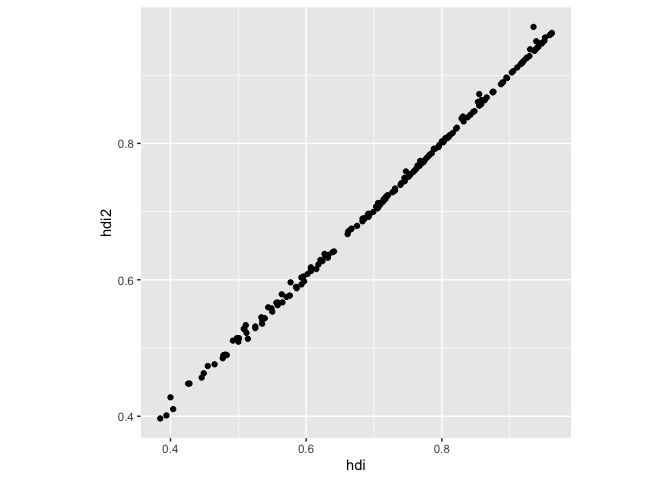

# tines

The goal of tines is to …

## Installation

You can install the released version of tines from CRAN with:

``` R
install.packages("tines")
```

And the development version from GitHub with:

``` R
# install.packages("remotes")
remotes::install_github("huizezhang-sherry/tines")
```

## Example - generate alternatives and code (HDI)

Start from a schema

``` r
library(tines)
(hdi <- example_schema())
#> $nodes
#> # A tibble: 3 × 9
#>   tag    action type  decision justification status inputs outputs source_schema
#>   <chr>  <chr>  <chr> <chr>    <chr>         <chr>  <list> <list>  <lgl>        
#> 1 block… varia… cons… apply m… to put them … VERIF… <lgl>  <lgl>   NA           
#> 2 block… combi… step  average… the most int… VERIF… <lgl>  <lgl>   NA           
#> 3 block… combi… step  use the… the geometri… VERIF… <lgl>  <lgl>   NA           
#> 
#> $edges
#> # A tibble: 3 × 3
#>   from            to              type      
#>   <chr>           <chr>           <chr>     
#> 1 block-scaling   block-education sequential
#> 2 block-combine   block-scaling   motivated 
#> 3 block-education block-combine   sequential
#> 
#> attr(,"class")
#> [1] "schema"
#> attr(,"name")
#> [1] "HDI Example"
```

Generate an alternative at block-combine and write the result into a
`yaml` file:

``` r
gen_alternatives(hdi, block = "block-combine", n = 1, 
                 file_path = here::here("inst/hdi-alt.yaml"))
```

``` r
#(res <- expand_tines(hdi, alternatives = here::here("inst/hdi-alt.yaml")))
```

Take the original schema, original code, and the alternatives and
generate a new R script that implements the alternative:

``` r
gen_code(hdi, 
         base_code = here::here("inst/hdi.R"), 
         alternative = here::here("inst/hdi-alt.yaml"),
         output_dir = here::here("inst/")
         )
```

Run the generated code and compare the results:

``` r
res_arith <- source(here::here("inst/alt_01_block_combine_arithmetic.R"))
#> ── Attaching core tidyverse packages ──────────────────────── tidyverse 2.0.0 ──
#> ✔ dplyr     1.1.4     ✔ readr     2.1.5
#> ✔ forcats   1.0.0     ✔ stringr   1.5.2
#> ✔ ggplot2   4.0.0     ✔ tibble    3.3.0
#> ✔ lubridate 1.9.4     ✔ tidyr     1.3.1
#> ✔ purrr     1.1.0     
#> ── Conflicts ────────────────────────────────────────── tidyverse_conflicts() ──
#> ✖ dplyr::filter() masks stats::filter()
#> ✖ dplyr::lag()    masks stats::lag()
#> ℹ Use the conflicted package (<http://conflicted.r-lib.org/>) to force all conflicts to become errors
#> Registered S3 method overwritten by 'tsibble':
#>   method               from 
#>   as_tibble.grouped_df dplyr

res_arith$value |> 
  ggplot(aes(x = hdi, y = hdi2)) + 
  geom_point() + 
  theme(aspect.ratio = 1)
```



## Example - generate alternatives and code (football)

Currently restricted by a rate limit.

Start from a schema

``` r
library(tines)
(football <- example_football())
#> $nodes
#> # A tibble: 3 × 9
#>   tag    action type  decision justification status inputs outputs source_schema
#>   <chr>  <chr>  <chr> <chr>    <chr>         <chr>  <list> <list>  <lgl>        
#> 1 block… defin… cons… average… incorporate … VERIF… <lgl>  <lgl>   NA           
#> 2 block… contr… step  victory… ratios are r… VERIF… <lgl>  <lgl>   NA           
#> 3 block… estim… step  fit a l… to answer th… VERIF… <lgl>  <lgl>   NA           
#> 
#> $edges
#> # A tibble: 3 × 3
#>   from                           to                   type      
#>   <chr>                          <chr>                <chr>     
#> 1 block-average-rater            block-logistic-model sequential
#> 2 block-logistic-model           block-average-rater  motivated 
#> 3 block-victory-tie-defeat-ratio block-logistic-model sequential
#> 
#> attr(,"class")
#> [1] "schema"
```

Generate an alternative at block-combine and write the result into a
`yaml` file:

``` r
gen_alternatives(football, block = "block-logistic-model", n = 2, 
                 file_path = here::here("inst/football-alt.yaml"))
```

Take the original schema, original code, and the alternatives and
generate a new R script that implements the alternative:

``` r
gen_code(football, 
         base_code = here::here("inst/football.R"), 
         alternative = here::here("inst/football-alt.yaml"),
         output_dir = here::here("inst/")
         )
```

Run the generated code and compare the results:

``` r
schema <- example_rdi()
code <- gen_composite_code(
  schema       = schema,
   base_scripts = list(
     spei_template = here::here("inst/spei.R"),
     spi_template  = here::here("inst/spi.R")
  ),
  output_file  = here::here("inst/rdi.R")
 )

validate_script(here::here("inst/rdi.R"), verbose = TRUE)
```
